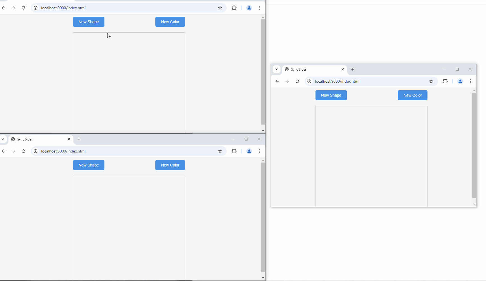
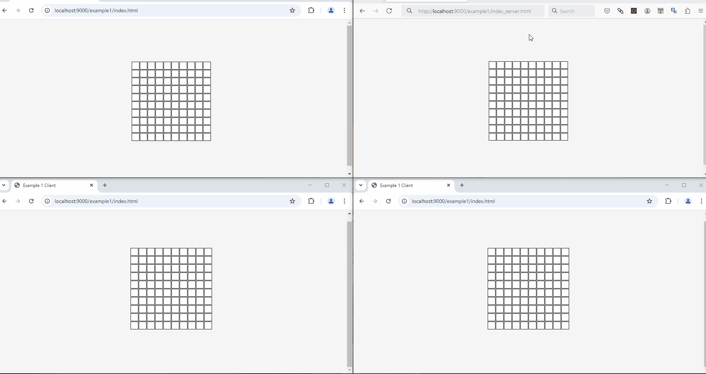

Real-time collaborative applications.

Use __.NET 9 AOT__ and __SignalR__. The final file is an executable file that runs directly on your operating system and does not require .NET to be installed.

Single excute file and run everywhere!!!

## How use

#### Build
Build in windows
``` sh
dotnet publish -r win-x64 -c Release
```
or linux:
``` sh
dotnet publish -r linux-x64 -c Release
```
For other environments see [.NET 9 Supported Versions](https://learn.microsoft.com/en-us/dotnet/core/install/windows#supported-versions) and [.NET 9 Known RIDs](https://learn.microsoft.com/en-us/dotnet/core/rid-catalog#known-rids).

#### Run 
1. Copy `Hamzaman` excute file (see [Releases](https://github.com/SMAH1/Hamzaman/releases))
2. Build and config `appsettings.json`
3. Creating `wwwroot` or other web roots defined in `appsettings.json`
4. Copy your web files into previous folder
5. Run the `Hamzaman`

Now, open internet browser and see result.

## Modes

#### Message

Establishes communication between all connected clients.



##### How to work


#### Server

Establishes communication between the server and the connected clients.



##### How to work


## Next
Build webpage or application in any language that supports __SignalR__ web sockets and use this project to communicate between them.