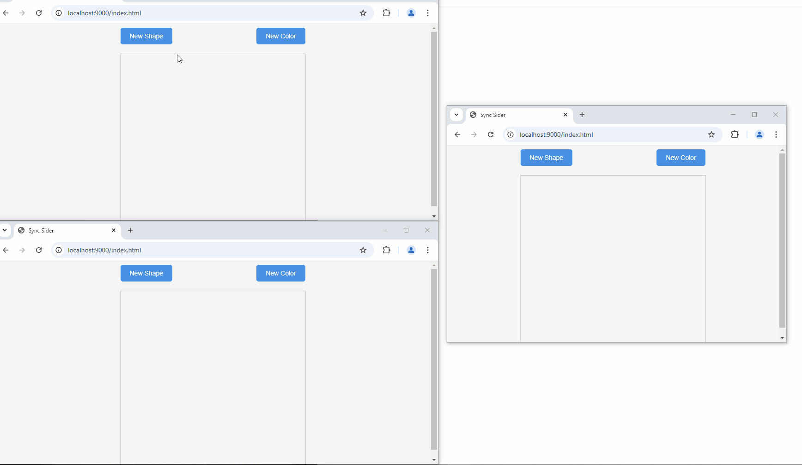
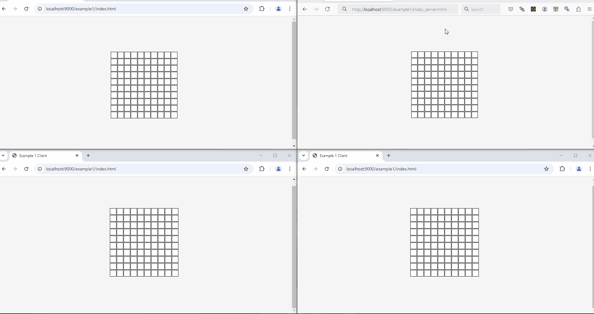

Real-time collaborative applications similar [Fluid Framework](https://github.com/microsoft/FluidFramework).

Use dotnet core AOT and SignalR.

Single excute file and run anywhre!!!

## How use

#### Build
Build in windows
``` sh
dotnet publish -r win-x64 -c Release
```
or linux:
``` sh
dotnet publish -r linux-arm64 -c Release
```

#### Run 
1. Copy excute file
2. Build and config `appsettings.json`
3. Creating `wwwroot` or other web roots defined in `appsettings.json`
4. Copy your file (example folder) into previous folder
5. Run the file

Now, open internet browser and see result.

## Modes

#### Message

Establishes communication between all connected clients.



#### Server

Establishes communication between the server and the connected clients.



## Next
Build website, application, or other language that supports _SignalR_ web sockets and use this project to communicate between them.